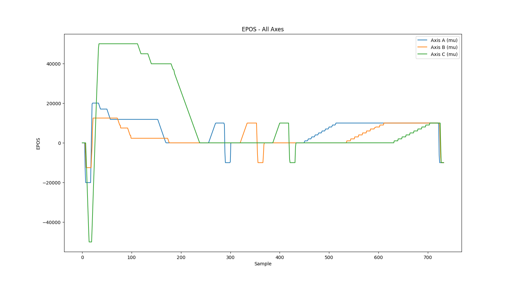

# Python-Library
In this folder you will find an example using Python code over USB (COM port) for an XD-M controller.

# Files:
These two are the two only required files:
* settings_default.txt: a sample file, you have to replace this one with the one provided with the Windows Interface on the USB stick
* Xeryon.py: this is the library. 

# Requirements
## Hardware
* Xeryon XD-M controller
* Xeryon motor
    * XLS
    * XVS
    * XLA
    * XRT-U
    * XVP
* USB cable
* Power adapter

## software
* setting_default.txt file
* Python installed on the computer
* Xeryon.py library
* Matplotlib library
```
pip install matplotlib
```
* Pyserial library
```
pip install pyserial
```

# Setting up controller
1. Connect your stages with the controller
2. Connect the controller with your computer using an USB cable
3. Power the controller

# Code example
## Imoprt library
Imprt all the fucntion from the Xeryon.py library and pyplot from matplotlib.
```py
from Xeryon import *                 # Import the Xeryon library
from matplotlib import pyplot as plt # Import the matplotlib library
```
## Initialize COM port
Select your COM port and the baudrate.
```py
controller = Xeryon("COM21", 115200) # Setup serial communication, select the correct COM-port and baudrate
```

## Initialize motor
Select the right type of XLS/XLA/XRT-U and give them a char as name.
```py
axisA       = controller.addAxis(Stage.XLS_312_3N, "A")     # Add axis A
axisB       = controller.addAxis(Stage.XLS_312_3N, "B")     # Add axis B
axisC       = controller.addAxis(Stage.XLS_78_3N, "C")      # Add axis C
...
```

## Starting the controller
First you need to start the motor.
```py
controller.start() # Start the controller
```

>[!NOTE]
>From here on, we will only continue on axis A. For axes B, C, ..., the same approach applies.

## Searching for the Index
The best thing to do in the beginnin is searching for the index.
```py
axisA.findIndex() # Search for the index
```

## Setting units
We will stat with using our mm.
```py
axisA.setUnits(Units.mm) # Set units to mm
```

## Start logging
If you want to have logged data you need to start the logging. You can call this function in your code at the location where you want the data logging to start.
```py
axisA.startLogging()     # Start logging
```

## Scaning
This code block shows a scan movend to the both sides.
```py
axisA.startScan(-1) # Start scan in the -1 direction
time.sleep(2)       # Wait 2 seconds
axisA.startScan(1)  # Start scan in the 1 direction
time.sleep(2)       # Wait 2 seconds
```

## change the speed
With this line of code you can chagne the speed. In this example we change it to 5 mm/s.
```py
axisA.setSpeed(5) # Set speed to 5 mm/s
```
## Scanning with a stop afther ... seconds
In this code block we show two ways of stopping a scan after 1 second. You can stop a scan by calling the **axisA.stopScan()** function. You can also specify in the **axisA.startScan(-1, 1)** fucntion after how many seconds the scan has to stop. In this example it is 1 second.
```py
axisA.startScan(-1)    # Start scan in the -1 direction
time.sleep(1)          # Wait 1 second
axisA.stopScan()       # Stop scan
time.sleep(2)          # Wait 2 seconds
axisA.startScan(-1, 1) # Start scan in the -1 direction for 1 second
time.sleep(2)          # Wait 2 seconds
```

## Going to a position
With the set **setDPOS()** function you can specify a spicif position the motor needs to move to. Earlier in the code we have set the units to mm, so **axisA.setDPOS(10)** means that the motor has to move to 10 mm.
```py
axisA.setDPOS(0)    # Go to position 0 mm
time.sleep(2)       # Wait 2 seconds
axisA.setDPOS(10)   # Go to position 10 mm
time.sleep(2)       # Wait 2 seconds
axisA.setSpeed(200) # Set speed to 200 mm/s
axisA.setDPOS(-10)  # Go to position -10 mm
time.sleep(2)       # Wait 2 seconds
axisA.setDPOS(0)    # Go to position 0 mm
time.sleep(2)       # Wait 2 seconds
```

## Steping
Another way of moving the motor is by taking steps. In this example we take 10 steps in the same direction.
```py
for _ in range(0,10): # Step 10 x 1 mm
    axisA
.step(1)     # Step 1 mm
    time.sleep(0.5)   # Wait 0.5 seconds
time.sleep(2)         # Wait 2 seconds
```

## Change units
```py
axisA.setUnits(Units.mu) # Set units to mu
axisA.setDPOS(-10000)    # Go to position -10000 mu
time.sleep(2)            # Wait 2 seconds
```

## Stuts bits
```py
print("Bit  0 = ", axisA.isAmplifiersEnabled())         # Check bit 0
print("Bit  1 = ", axisA.isEndStop())                   # Check bit 1
print("Bit  2 = ", axisA.isThermalProtection1())        # Check bit 2
print("Bit  3 = ", axisA.isThermalProtection2())        # Check bit 3
print("Bit  4 = ", axisA.isForceZero())                 # Check bit 4
print("Bit  5 = ", axisA.isMotorOn())                   # Check bit 5
print("Bit  6 = ", axisA.isClosedLoop())                # Check bit 6
print("Bit  7 = ", axisA.isEncoderAtIndex())            # Check bit 7
print("Bit  8 = ", axisA.isEncoderValid())              # Check bit 8
print("Bit  9 = ", axisA.isSearchingIndex())            # Check bit 9
print("Bit 10 = ", axisA.isPositionReached())           # Check bit 10
print("Bit 11 = ", axisA.isErrorCompensation())         # Check bit 11
print("Bit 12 = ", axisA.isEncoderError())              # Check bit 12
print("Bit 13 = ", axisA.isScanning())                  # Check bit 13
print("Bit 14 = ", axisA.isAtLeftEnd())                 # Check bit 14
print("Bit 15 = ", axisA.isAtRightEnd())                # Check bit 15
print("Bit 16 = ", axisA.isErrorLimit())                # Check bit 16
print("Bit 17 = ", axisA.isSearchingOptimalFrequency()) # Check bit 17
print("Bit 18 = ", axisA.isSafetyTimeoutTriggered())    # Check bit 18
print("Bit 19 = ", axisA.isEtherCatAcknowledge())       # Check bit 19
print("Bit 20 = ", axisA.isEmergencyStop())             # Check bit 20
print("Bit 21 = ", axisA.isPositionFailTriggered())     # Check bit 21
```

## End logging
With the code below you are able to end the logging.
```py
logs = axisA.endLogging() # Stop logging
print(logs)               # Print logs
```

## Plot data
Here you can find an example of how to plod the data in a graf. In this graf we will plot the encoder positions.
```py
epos_a_raw = logs["EPOS"][0::3]
epos_b_raw = logs["EPOS"][1::3]
epos_c_raw = logs["EPOS"][2::3]

# Convert encoder units to units for each axis
epos_a = [axisA.convertEncoderUnitsToUnits(v, axisA.units) for v in epos_a_raw]
epos_b = [axisB.convertEncoderUnitsToUnits(v, axisB.units) for v in epos_b_raw]
epos_c = [axisC.convertEncoderUnitsToUnits(v, axisC.units) for v in epos_c_raw]

plt.plot(epos_a, label='Axis A (' + str(axisA.units) + ')')
plt.plot(epos_b, label='Axis B (' + str(axisB.units) + ')')
plt.plot(epos_c, label='Axis C (' + str(axisC.units) + ')')

plt.ylabel('EPOS')
plt.xlabel("Sample")
plt.title("EPOS - All Axes")
plt.legend()
plt.show()
```

## Stop controller
At the end of your code, it is best to stop the controller.
```py
controller.stop() # Stop the controller
```

# Output of the logged data


# Note
* This code is tested in Python version 3.14.2
* This code is tested in VS Code
* In this example the following stages are used:
    * Stage A is an XLS with a length of 60 mm
    * Stage B is an XLS with a length of 40 mm
    * Stage C is an XLS with a length of 120 mm
* This code does not work for the XLA-5-INTG